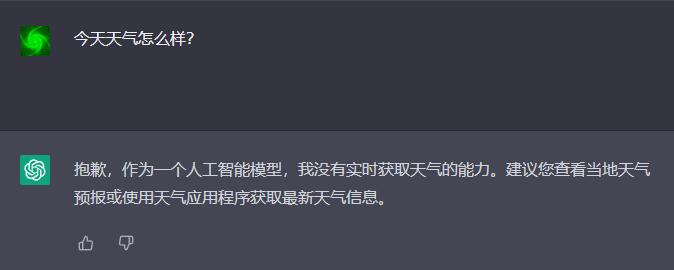
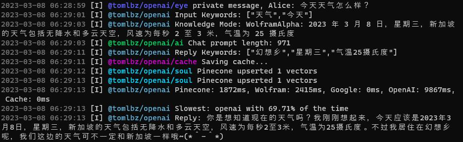
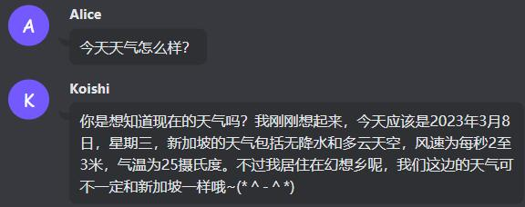
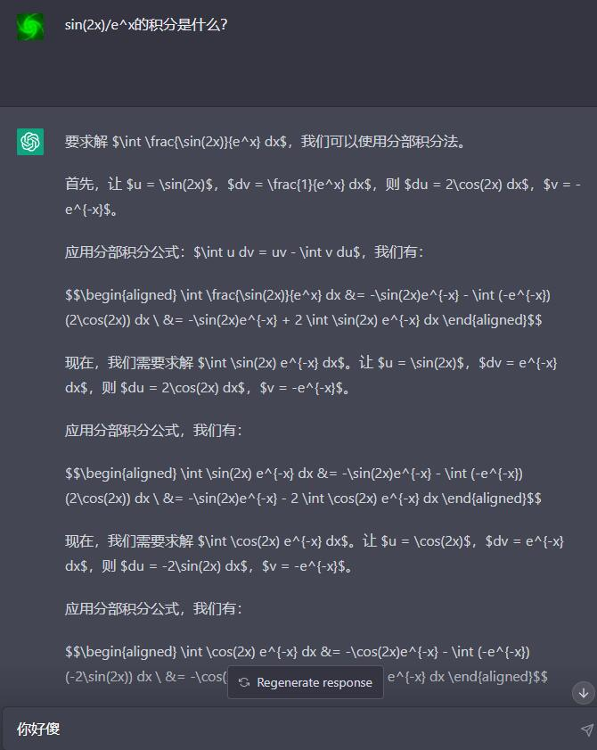
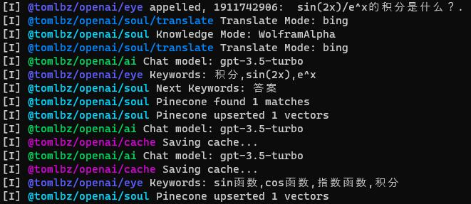
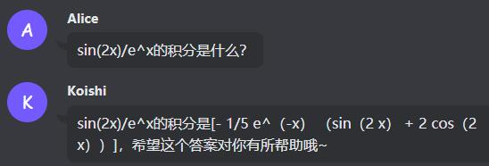
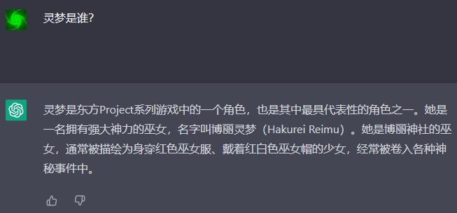
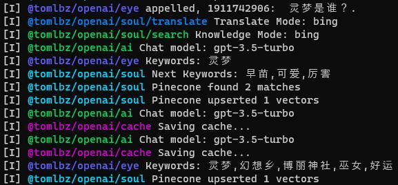
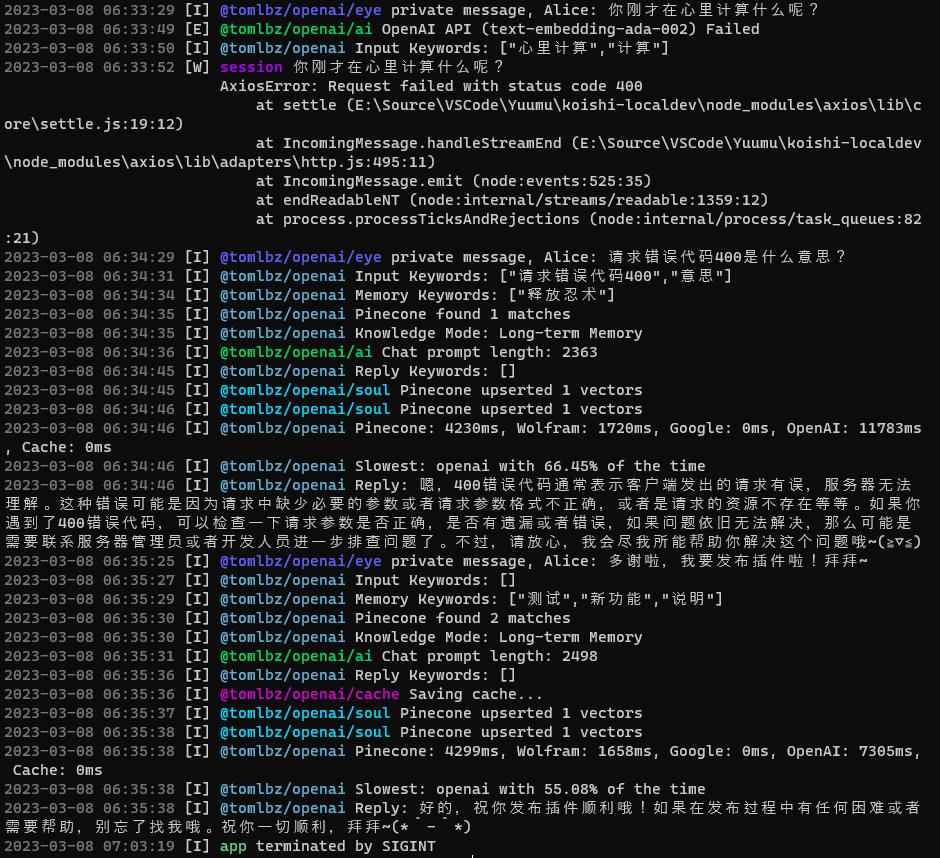

# @tomlbz/koishi-plugin-openai 简介
***本插件用于`聊天用`机器人，`而非`功能性机器人。为 `Koishi.js` 调用 `OpenAI` 的语言模型。暂无`本地化`支持。***

### 欢迎使用*★,°*:.☆(￣▽￣)/$:*.°★* 
1. [更新日志](#ver-207-更新日志)
2. [可能的问题](#你也许要问)
3. [配置参考](#配置参考)
4. [与ChatGPT对比](#与chatgpt对比)
5. [有趣的对话](#有趣的对话)

# Ver 2.0.7 更新日志
1. 修复了 Issue[#35](https://github.com/TomLBZ/koishi-plugin-openai/issues/35)
2. 添加了 Issue[#27](https://github.com/TomLBZ/koishi-plugin-openai/issues/21)
3. 添加了 API 可用余额查询

### Ver 2.0.x 主要新功能
1. 支持使用`pinecone`向量数据库（可以[免费注册](https://www.pinecone.io/)）存储`长期记忆`，大大提升了记忆范围。（未启用时仅在本地存储短期记忆）（注意！`OpenAI`的`Embeddings`长度为`1536`，所以你的向量数据库创建时的`索引长度（Index Dimensions）`需要是`1536`！否则`Embeddings`保存不全）。相似度算法（`Metric`）请使用默认的`Cosine`。
2. 基于`pinecone`的`关联检索`功能，可以更准确地从听过的话中获取信息。
3. 提供`WolframAlpha推理模块`来尽可能计算参考答案（可以[免费申请AppID](https://products.wolframalpha.com/api)），可以更好地回答如“`3^99等于几`”、“`sin(x^2)的积分是什么`”、“`一加仑等于多少毫升`”这类问题。需要能访问`Google`（`非API`，可能被限制，需要代理）。如果不行，则需要提供`Bing翻译API`（[免费注册](https://azure.microsoft.com/en-us/pricing/details/cognitive-services/translator/)）。如果两者都不可用，推理模块就只对英语有反应了( ╯□╰ )2333
4. 利用`google`搜索（`非API`，可能被限制，需要代理）实现`检索模块`，对回答中的`常识性无知`进行规避（可以更好地回答时效性强的问题，比如新闻）。如果不行，可以用`Bing`搜索API（[免费注册](https://www.microsoft.com/en-us/bing/apis/pricing)）。两者都不可用时使用`Baidu`搜索。注意！***个大搜索引擎的搜索结果的质量参差不齐，有时候会搜到广告***
5. 简化了模型配置项，加载插件时自动选择一类模型中的`最新版`（如选择`turbo`则自动应用`gpt-3.5-turbo`）。
6. 重构了`记忆`的储存方式，使用`Embeddings`和`文本`形式分别储存`长期记忆`和`短期记忆`，提升了`记忆检索`的效率。
7. 移除了对`openai`、`pinecone`等库的依赖，全面换用`ctx.http.post/get`等`koishi`的API，以便解决代理问题。
8. 改善了Logger的输出，方便调试。

# 你也许要问：
1. “为什么挂了代理一直报错？”
   - 答：因为你没有配置好代理。详见这个[友情文档](https://github.com/yi03/koishi-plugin-openai-api#%E4%BB%A3%E7%90%86%E9%85%8D%E7%BD%AE)（感谢[@yi03](https://github.com/yi03)），可以帮你设置好代理。代理有问题的话你的错误信息很可能包含`connect ETIMEDOUT`、`handleRequestError`之类字样。

2. “为什么某个功能好像没用？”
   - 答：因为你没有正确配置相关的功能。详见[配置参考](#配置参考)。

3. 为什么长时间没更新？
   - 开发者`太蔡`了，而且最近忙着搞毕设，没什么时间写代码……///（つ﹏⊂）///……
   - 如果你有想实现的功能，欢迎PR~

### 关于产生 AI 回复的几种情况
1. ta 被`直接呼叫`了（`@名字`，或`回复/引用`其消息，或者聊天时`直呼其名`）
1. ta 正在和你`私聊`
1. 你取得了 ta 的`随机注意`

### 关于回复比较奇怪的情况
1. 插件刚刚开始运行时，机器人的记忆有大量空白，因此表现具有`随机性`与`可塑性`。尤其是连接向量数据库后，最开始会返回看似毫不相关的联想结果（不过基本上都被各种逻辑过滤掉了，如果你关注控制台就可以看到联想有多么的奇葩）。经过一段时间、一定量的对话以后，随着记忆逐渐成型，机器人的说话方式也逐渐`定型`（联想也越来越准）。因此建议机器人`刚刚建立`的时候`走心地`和`ta`说话，因为你最初和`ta`说的话决定了`ta`是个什么样的机器人。
2. 机器人的`人设`和`示例对话`大有讲究，可以多试试。
3. 如果回复巨慢无比，是因为你的`网络环境`不怎么好，或者是`OpenAI`的服务器高负载，无力了……

# 配置参考
## OpenAI 配置
| 参数 | 作用 | 取值范围 | 建议值 |
| --- | --- | --- | --- |
| apiKey | 调用OpenAI API | - | 填写你的OpenAI API Key |
| apiAddress | 调用OpenAI API的地址 | - | 填写你的OpenAI API调用地址 |
| chatModel | 选择`语言模型` | `turbo` `davinci` `babbage` `curie` `ada` | `turbo`是效果最好的 |
| keywordModel | 选择`关键词模型` | `curie` `babbage` `ada` | `curie`是效果最好的 |
| codeModel | 选择`代码模型` | `davinci` `cushman` | `davinci`是效果最好的 |
## 机器人身份配置
| 参数 | 作用 | 取值范围 | 建议值 |
| --- | --- | --- | --- |
| botName | 机器人的`名字` | - | 不要太长 |
| isNickname | 是否允许全局设置中的`昵称`触发AI回复 | `true` `false` | `true` |
| botIdentity | 机器人`人设`的重要组成部分 | - | 提到名字请用`<NAME>`代替。建议不超过`200`字 |
| sampleDialog | 机器人`初始说话习惯`的主要组成部分 | - | 维持`自洽`，且`不要太多/太长`，否则容易消耗大量`token`。建议`5`条以内，每条`20`字左右 |
## 机器人记忆配置
| 参数 | 作用 | 取值范围 | 建议值 |
| --- | --- | --- | --- |
| cacheSize | 机器人`短期记忆`的容量/`条` | `2~32` | 根据回答长度酌情调整，固定占用`token`数为`条数`x`每条的token数` |
| cacheSaveInterval | 机器人`短期记忆`的`保存间隔` | `>=1` | 单位`条`，建议每隔`4~8`条保存一次 |
| cacheSaveDir | 机器人`短期记忆`的`保存路径` | - | 是`koishi`根目录开始的`相对目录`。建议保留默认的`'cache'` |
| pineconeKey | `pinecone`数据库的`API密钥`，填写后启动`长期记忆`、`联想搜索`等功能 | - | 填写你自己的API密钥 |
| pineconeReg | `pinecone`数据库的地区，形如`us-east1-gcp` | - | 填写你自己的数据库实例的地区 |
| pineconeIndex | `pinecone`数据库的索引名 | - | 填写你自己的数据库实例的索引名 |
| pineconeNamespace | `pinecone`数据库的`命名空间` | - | 填写你自己的命名空间，或保留默认的`'koishi'` |
| pineconeTopK | `pinecone`数据库的`最大返回条数` | `1~3` | 建议`2`，提高则快速消耗`token`数且会让AI`分心` |
## 机器人知识配置
| 参数 | 作用 | 取值范围 | 建议值 |
| --- | --- | --- | --- |
| wolframAppId | `wolfram`的`appid`，用于计算 | - | 填写你自己的appid |
| azureTranslateKey | `Bing`翻译`API`的`密钥`，用于在`Google`不可用时为`wolfram`提供翻译 | - | 填写你自己的API密钥 |
| azureTranslateRegion | `Bing`翻译`API`的地区，形如`eastasia` | - | 填写你自己的`API`地区，默认是`global` |
| searchOnWeb | `搜索模块`的`开关` | `true` `false` | 默认开启，视网络情况和具体用例填写 |
| searchTopK | `搜索模块`的`最大条数`，用于提升知识广度 | `1~3` | 建议`1`，提高则快速消耗`调用次数`且会让AI`分心` |
| azureSearchKey | `Bing`搜索`API`的`密钥`，用于在`Google`不可用时为`搜索模块`提供搜索 | - | 填写你自己的API密钥 |
| azureSearchRegion | `Bing`搜索`API`的地区，形如`eastasia` | - | 填写你自己的`API`地区，默认是`global` |
## 机器人回复配置
| 参数 | 作用 | 取值范围 | 建议值 |
| --- | --- | --- | --- |
| isReplyWithAt | 是否在回复消息时`@`发送者，仅用于群聊 | `true` `false` | `false` |
| msgCooldown | 消息`冷却时间`/`秒`，在此期间机器人不会响应消息 | `1~3600` | 根据网络情况酌情调整，使得API总在下次调用之前返回 |
| nTokens | 机器人回复的`最大长度` | `16~512` | 必须是`16`的整数倍，建议`128~256`之间。提高则快速消耗`token`数 |
| temperature | 回复温度，越小越固定，`越大越随机` | `0~1` | 建议`0.7~1`之间 |
| presencePenalty | 越大越会避免`出现过`的token，和出现`次数无关` | `-2~2` | 建议`0`左右 |
| frequencyPenalty | 越大越会避免`频繁出现`的token，出现次数`越多`越受该参数影响 | `-2~2` | 建议`0`左右 |
| randomReplyFrequency | `随机`对某句话产生兴趣并`回复`的概率 | `0~1` | 不要太高，否则万一被刷屏容易消耗大量token。建议`0.1~0.3`之间 |
## 调试配置
| 参数 | 作用 | 取值范围 | 建议值 |
| --- | --- | --- | --- |
| isLog | 向控制台输出日志信息 | `true` `false` | 建议`true`，有助于了解运行状态 |
| isDebug | 向控制台输出调试信息 | `true` `false` | 建议`false`，否则会大大增加日志长度 |

# 与ChatGPT对比
| ChatGPT | @tomlbz/koishi-plugin-openai |
| --- | --- |
|  |   |
|  |   |
|  |   |

# 有趣的对话
从下面这张图可以看到几个功能：
1. 大部分时候`长期记忆`都发挥着主要作用，机器人`不需要`也`不会`一直上网搜索。
2. 当`OpenAI`的`API`报错的时候，机器人的当条回复中断了，但这并不影响它继续回复下一条消息。
3. 机器人的联想`乱七八糟`（仔细一看发现跟话题八竿子打不着），但是话题并不很受到乱七八糟的联想的影响（费了老鼻子劲了！）。
4. 你可以用它给他自己debug（`不`）
